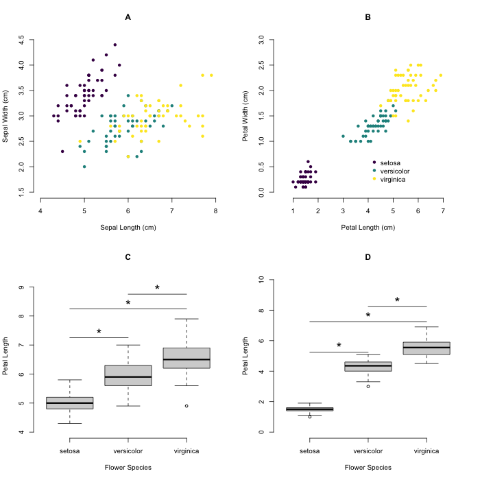

## Iris Figure Caption
### Margaret Li

#### Figure
 

"Four graphs characterizing sepal length and width and petal length and width among different flower species were analyzed using R. Figure A depicts sepal width (cm) vs sepal length (cm), with colors representing different flower species. Sepal length ranges from 4-7 cm across the x-axis and sepal width ranges from 1.5-4.5. Figure B shows petal width (cm) vs petal length (cm), with colors representing different flower species. Graph shows a directly proportional trend, with setosa, versicolor, and virginica species increasing petal length and widths linearly. Figure C and D are box plots comparing sepal and petal lengths against flower species, respectively. There is statistical significance between sepal length and petal length, indicating that sepal length and petal length are specific to their respective flower species. "
