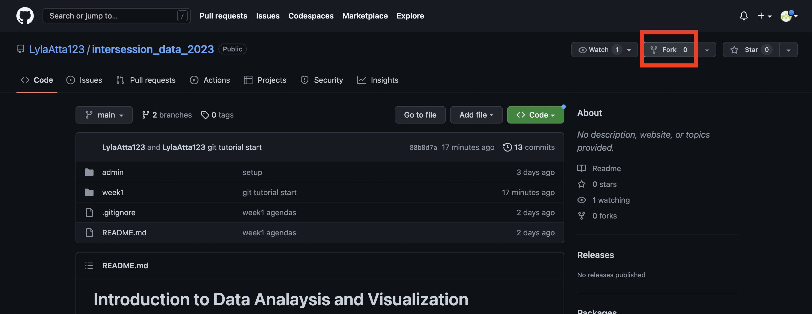
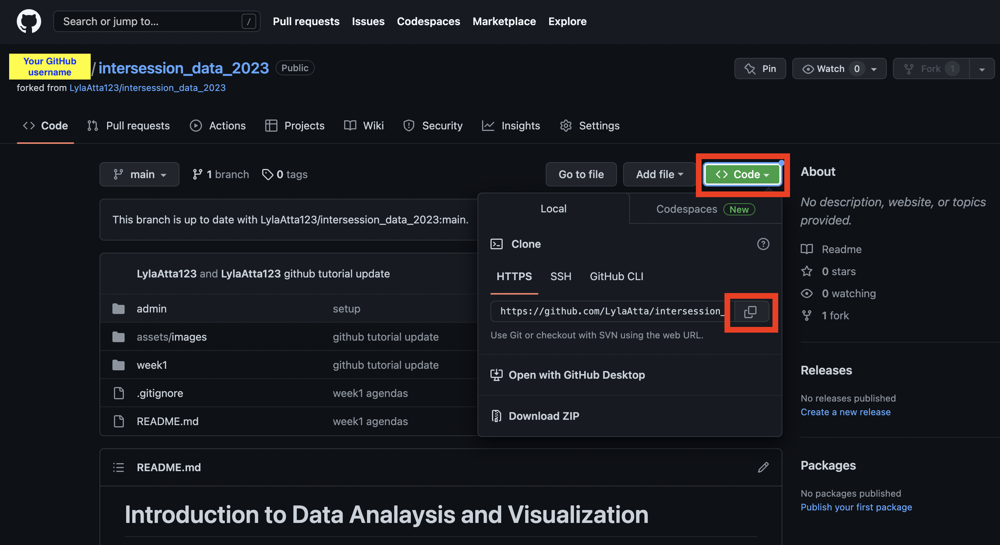

## Day 2 - Thursday January 5th 

### GitHub Tutorial

Git is a popular version control software that is very helpful in tracking versions of code during the development process. It keeps track of every file in the project repository and allows you to restor previous versions if things go wrong. GitHub allows you to host projects remotely so that multiple people can contribute to a project without contributors having to email each other files titled 'script_version_13_final_final.R'. Especially when working on projects where multiple people are contributing to code, it's easy to lose track of which version is the most up to date and things can go wrong if an important piece of code is overwritten in an update. GitHub's features also come in handy when working on a project by yourself, not only for the version control capabilities, but also because you can access your project from multiple machines if you have an internet connection.  

To get practice with GitHub in this class, we will be adding data analyses and visualizations to the class GitHub. You are also welcome to create your own GitHub repositories for your class projects.   

1. Getting started
- Create a GitHub account: https://github.com/join  
- Install Git on your machine:  
	- If you are working on a mac or linux, you may already have Git installed. To check if you have git installed already, launch terminal and type the command `git version`. You should see something like this:   

	   

	- If not, you can download and install git from here: https://git-scm.com/downloads   

2. Make a fork of the class repo
- Making a fork copies an existing repository to your account. It maintains a a link to the original parent respository so that you can update your copy whenever the parent repository changes and you can also contribute new changes in your respository to the parent.  
https://docs.github.com/en/get-started/quickstart/fork-a-repo  
- To create a fork, navigate to the class repo on the GitHub website: https://github.com/LylaAtta123/intersession_data_2023  
- In the top right you will see a "Fork" button:  
   
- Follow the instructions to finish creating the repo.  

3. Clone your forked repo 
- Cloning a repo creates a local (on your machine) copy of the repository that is hosted on GitHub. This allows you to create/delete files and make changes as if you were working in a regular directory on your computer.  
- To clone the repo, go to your forked repo in your GitHub account. Make sure in the top left you see [YOUR GitHub USERNAME/intersession_data_2023]. On the top right, you'll see a green "Code" button. After you click on code, copy the repo address.  
   
- In terminal enter the command `git clone [repo address]`. I like to keep all my GitHub repos in a folder called GitHub for organizational purposes.  

4. Make and push a change in your local repo
- As your first change to the class GitHub, create a profile (real or imaginary) to add to the class website. Copy and modify the template example in the authors folder.  
- To sync the changes you have made locally to your remote repository hosted on GitHub you need to: 
	- Add the changes to the git staging area. This tells git which changes you want to sync to the remote repository. We want to sync all (1) changes: 
		- In terminal, navigate to your GitHub repo. `cd [directory name]` to navigate to a directory, `cd ..` to navigate to a parent directory, and `ls` to list file in current directory are helpful commands.  
		- When you're in your GitHub repo, enter the command `git add .` to add all changes to the git staging area. In the future, if you want to add a specific file to the staging area, you can use `git add [filename]` instead. 
		- To check that you files have been added, you can use the command `git status`. You should see your changed file in green.  
		- You can read more about the git staging area here: https://www.atlassian.com/git/tutorials/saving-changes  
	- Commit changes. This tells git that this is a snapshot of the project that you want to capture. It is helpful (vital!) to add a meaningful commit message to each commit to enable you (or your project collaborators) to figure out how the project was updated in this step, in case you ever need to revert back to this snapshot.  
		- To commit changes and add a commit message, enter the command `git commit -m [your message]`  
	- Now that you have committed your changes, you can "push" those changes to the remote repository:
		- `git push`  
		- You should now be able to see your added file in your forked repo on the GitHub website.  
- Note on the `.gitignore` file:  
	- Remember how we used `git add .` to add all changed files to the staging area? Sometimes we want to add all files to the staging area except certain types of files. These could be large data files (GitHub has a 100Mb size limit) or temporary files that are not relevant to the project. You can tell git to ignore certain files by adding them to the `.gitignore` file. The `.gitignore` file is usually hidden, you can see it if you enter `ls -a` to list all files. 

